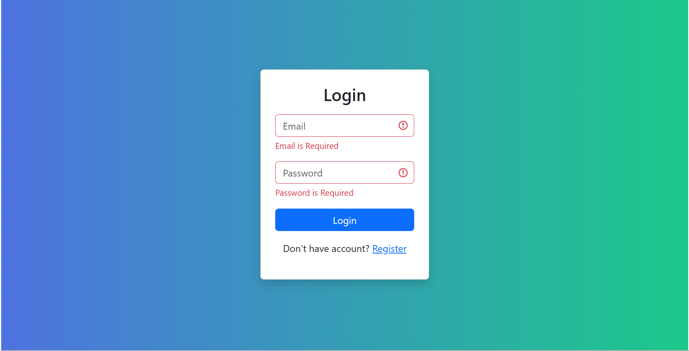
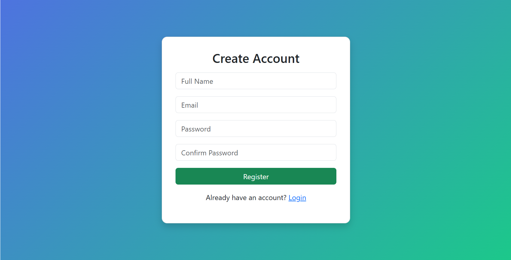
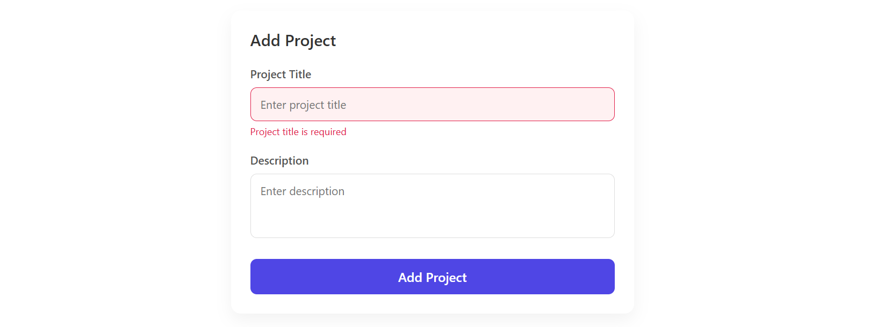
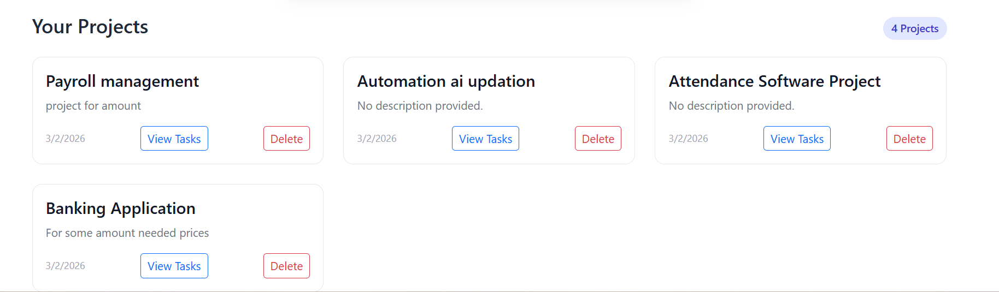
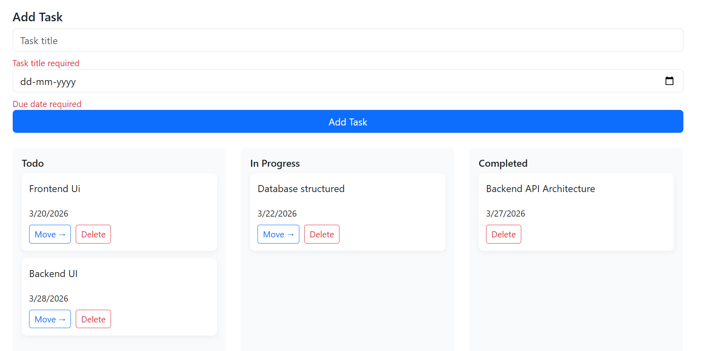

# ProjectFlow – Project & Task Management System

A full-stack MERN application for managing projects and tasks (Jira-style Kanban board).

---

## Features

-  User Authentication (Login / Register)
-  Create & Delete Projects
-  Manage Tasks inside Projects
-  Kanban Board (Todo / In Progress / Completed)
-  Due Date Management
-  Toast Notifications
-  Form Validation using Formik & Yup
-  Modern UI with Bootstrap 5 + CSS Modules

---

## 🛠 Tech Stack

### Frontend
- React.js
- Bootstrap 5
- Formik
- Yup
- React Router
- Axios
- React Hot Toast

### Backend
- Node.js
- Express.js
- MongoDB
- Mongoose
- JWT Authentication

---

## UI Screenshots

### Login Page


### Register Page


### Dashboard


### ProjectList


### Task Board


---

# Installation Guide

---

## 🔹 1️⃣ Clone the Repository

```bash
git clone https://github.com/vikashvicky7575/Task_Project.git
cd Task Project
```

---

#  Backend Setup

```bash
cd backend
npm install
```

### Create `.env` file inside backend folder

```env
PORT=5000
MONGO_URI=your_mongodb_connection_string
JWT_SECRET=your_secret_key

for demo i used this jwt & mongoDB:
# mongoDB Connection
MONGO_URI=mongodb://127.0.0.1:27017/project_management
# JWT Key
JWT_SECRET=3e28a5ca8280903f02217caf0739266ca9d625e347d757c38e11d2eff2a49debe83320cbe223f824027669da29903198076530fee2aaf6e0417bcf6183d81829
```

### Run Backend Server

```bash
npm run dev
```

Backend runs on:
```
http://localhost:5000
```

---

# Frontend Setup

```bash
cd frontend
npm install
```

### Create `.env` file inside frontend folder

```env
REACT_APP_API_URL=http://localhost:5000/api
```

### Run Frontend

```bash
npm start
```

Frontend runs on:
```
http://localhost:3000
```

---

# Authentication Flow

1. User registers or logs in.
2. Backend validates credentials.
3. Backend generates JWT token.
4. Token is sent to frontend.
5. Frontend stores token in localStorage.
6. Axios automatically attaches token to protected API requests.
7. Backend middleware verifies token before allowing access.

---

# API Endpoints

---

## Auth Routes

| Method | Endpoint | Description |
|--------|----------|-------------|
| POST | /api/auth/register | Register a new user |
| POST | /api/auth/login | Login user |

---

## Project Routes

| Method | Endpoint | Description |
|--------|----------|-------------|
| GET | /api/projects | Get all user projects |
| POST | /api/projects | Create a project |
| DELETE | /api/projects/:id | Delete project |

---

## Task Routes

| Method | Endpoint | Description |
|--------|----------|-------------|
| POST | /api/task | Create task |
| GET | /api/task/:projectId | Get tasks by project |
| PATCH | /api/task/:id | Update task status |
| DELETE | /api/task/:id | Delete task |

---

# Database Relationships

- One User ➝ Multiple Projects
- One Project ➝ Multiple Tasks
- One Task ➝ Belongs to one Project and one User

---

# Application Workflow

1. User logs in.
2. Dashboard loads all projects.
3. User selects a project.
4. Task board displays tasks in 3 columns:
   - Todo
   - In Progress
   - Completed
5. User can:
   - Add Task
   - Update Status
   - Delete Task
6. Changes update MongoDB instantly.

---

# Future Improvements

- Drag & Drop functionality
- Task priority levels
- Task comments
- Role-based access
- Real-time updates (Socket.io)
- Deployment (Render / Vercel)

---

**Vikash Kumar**  
MERN Stack Developer  

GitHub: https://github.com/vikashvicky7575

---
